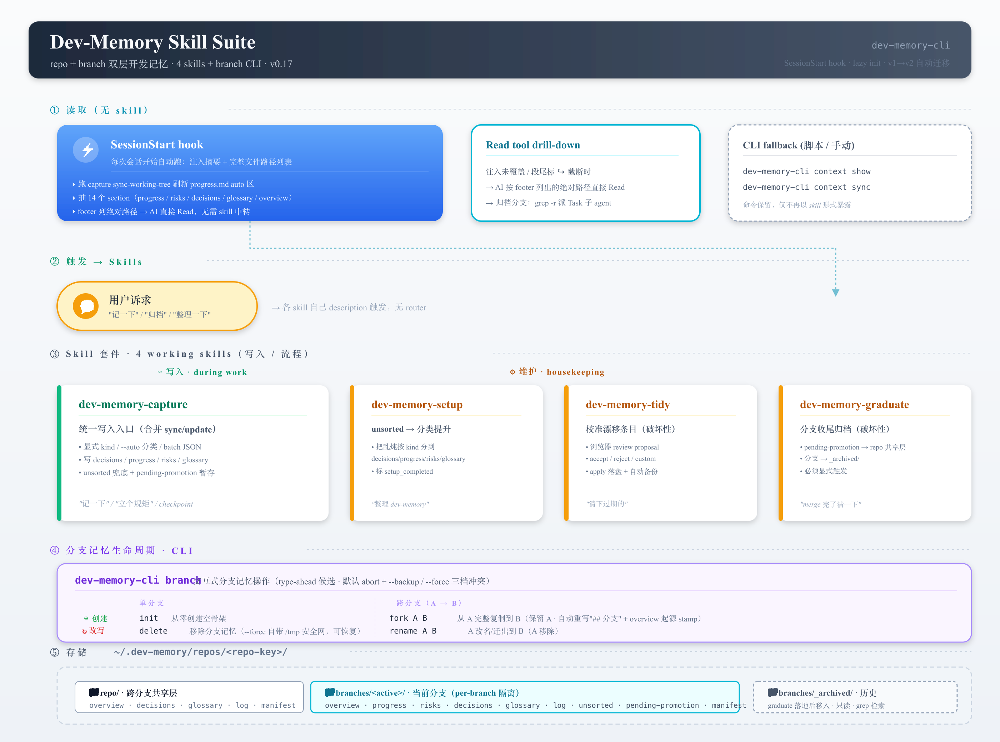
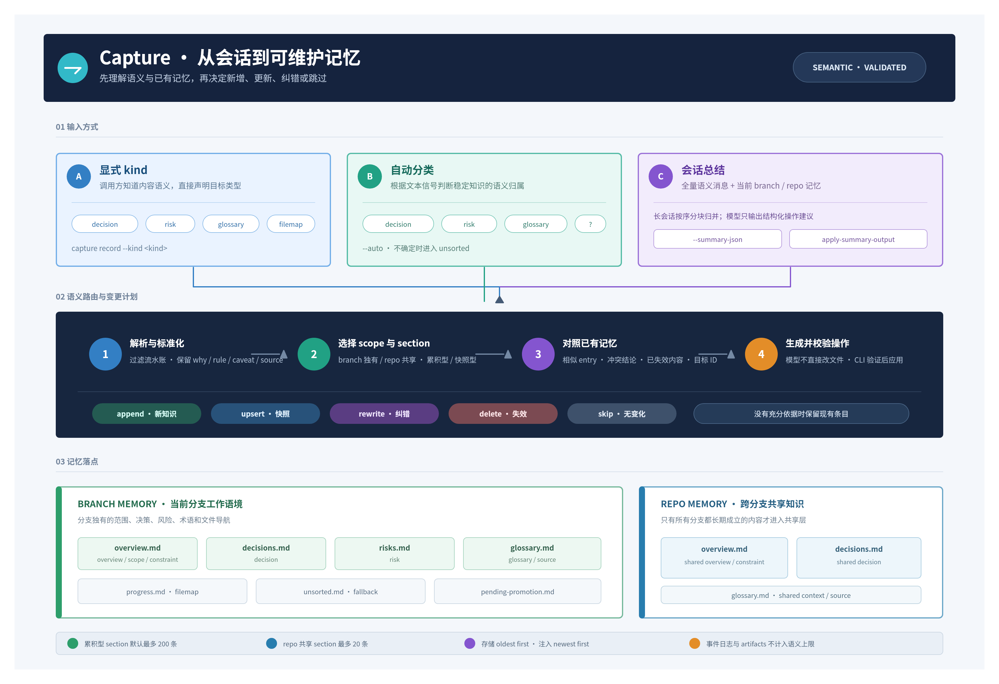
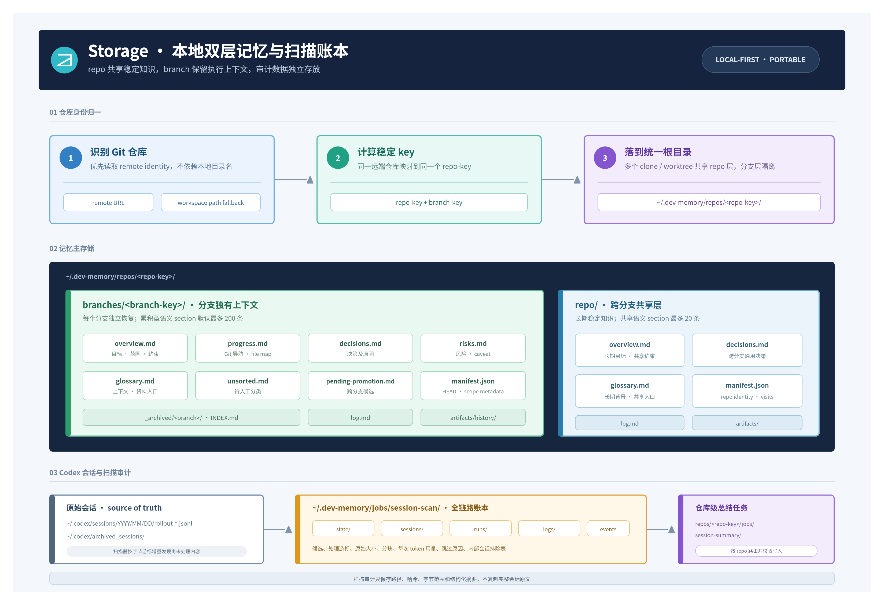

# Dev Memory Skill Suite

面向 Codex、Claude 等 agent 运行时的 **repo + branch 双层开发记忆** 技能套件。

这套仓库只做一件事：把"开发记忆"从 Git 工作区里拿出来，放到用户目录下，按 `(仓库身份, 分支)` 作为主 key 维护，让跨会话的开发上下文可恢复、可修正、可沉淀、可归档，同时不污染工作区、不和 Git 历史互相干扰。



## v2 架构：4 个 Skill + branch CLI

v2 把旧的 sync + update 合并成统一的 capture，并把 setup 从前置门禁改为 merge 动作、加 lazy init、加 v1→v2 自动迁移。0.16 起取消 `using-dev-memory` 路由总入口；0.17 起再取消 `dev-memory-context` 读取 skill —— SessionStart hook 注入末尾直接列出权威记忆文件的绝对路径，AI 需要详情时 Read 对应文件即可，不再需要 skill 中转。当前套件 4 个 skill（全部偏写入 / 流程 / 整理）。

| Skill | 定位 | 典型触发 |
| --- | --- | --- |
| `dev-memory-capture` | **统一写入入口**（合并 sync + update） | 本轮产生稳定结论 / checkpoint / 用户手动记一笔 / 改写旧条目 |
| `dev-memory-setup` | 整理 unsorted.md + 补元信息 + 标 setup_completed（不再是前置门禁） | unsorted.md 累积、用户明确说"整理一下" |
| `dev-memory-tidy` | **定期校准入口**：已结构化条目漂移时（陈旧 / 重复 / 模板残留），agent 聚合 proposal → 浏览器审 → apply 落盘 + 自动备份 | 用户说"整理一下记忆 / 清下过期的 / 看看哪些还成立" |
| `dev-memory-graduate` | 分支收尾：从 pending-promotion 提炼上提 + 归档 branch | 用户显式说"归档 / 分支收尾 / merge 完清一下" |

> 读取路径：SessionStart hook 自动注入 progress / risks / decisions 等摘要 + 完整文件路径；后续直接 Read 文件，或跑 CLI `dev-memory context show` / `context sync` 拿 paths / 重新刷新（命令保留，只是不再以 skill 形式暴露）。

详细设计与语义见：

- [docs/dev-memory-skill-suite-guide.md](docs/dev-memory-skill-suite-guide.md) — 套件整体说明
- [docs/workspace-mode.md](docs/workspace-mode.md) — 多 repo workspace 模式

### Lazy init 与 setup 的新关系

v2 里 capture 写入永远先 lazy init（骨架不存在就自动建），不再需要前置 setup。setup 的新职责：扫 `unsorted.md` 把未分类条目按用户选择 merge 到 decisions/progress/risks/glossary，再标 `manifest.setup_completed = true`。setup 之前 / 之后的区别是 capture 的 heuristic 兜底策略：之前"不确定 → unsorted"，之后"不确定 → progress"。

### Capture 的写入路由



Capture 有三种写入模式：

- **显式 kind**（`--kind decision` 等）：最精准，直接路由到目标文件
- **自动分类**（`--auto` 或默认）：走 `classify_content` 正则 heuristic，根据关键词落到 decision / risk / glossary / progress / unsorted
- **批量 session payload**（`--summary-json`）：会话末尾一次性记多类信息

每次写入还会过一次 `is_cross_branch_candidate`：如果内容不含分支特有名词 + 含"经验/模式/通用"类信号，会额外 append 到 `pending-promotion.md`，供 graduate 预筛。

每个 kind 有自己的 `default_mode`：
- 累积型（decision / risk / glossary）默认 **append**，新条目不覆盖旧的
- 快照型（progress / next / overview / scope / stage / constraint）默认 **upsert**，始终反映最新状态

### Capture dedup check（0.18 起）

append 类 kind 写入前会对目标 section 做相似度查重，阻止 append-only 累积矛盾决策（典型场景：6 天里"5/14 旧版"+"5/15 修正"+"5/19 再修正"三层叠加互相矛盾）。

- **算法**：`difflib.SequenceMatcher` 比 first non-empty line 前 80 字符；中文 supersedes 关键词（`重新校正 / 已更新 / 推翻 / 取代` 等）+0.15 boost
- **阈值**：similarity ≥ 0.7 视为疑似重复
- **行为**：命中拦下不写，`exit 2`，stdout 返 `dedup_hint` 含 `matches[]` + `recommendation`（`update_existing` / `review_and_decide`）
- **agent 处理**：按 recommendation 分流：
  - 修订旧条目 → `dev-memory capture rewrite-entry --id <match_id> --content <text>`（新 subcommand）
  - 确实是独立新事实 → `dev-memory capture record --force ...`（绕过查重）
  - 误判同义 / 暂不写 → 不调任何命令
- **绕过**：`--force` flag；upsert 类 kind（progress / next / overview / scope / stage / constraint）天然跳过 dedup
- **批量**：`--summary-json` 每条独立 check，blocked 项进 stdout `dedup_blocked[]`，未 blocked 部分照常写

### Setup vs Tidy vs Graduate（三个整理动作的边界）

| 命令 | 输入状态 | 输出状态 | 主要动作 |
|---|---|---|---|
| `setup` | 无序（unsorted.md 一堆乱炖）| 有序（按 kind 分类塞进 decisions/progress/...）| add |
| `tidy` | 有序但漂移（陈旧 / 重复 / 模板残留）| 有序且校准 | delete + edit + reset（破坏性，先备份）|
| `graduate` | 分支完成 | 跨分支知识上提 + 归档 branch 目录 | 提炼 + 归档 |

三个互不替代：tidy 不分类、不归档、不跨分支提炼；setup 不删、不重写；graduate 不动单分支内的 stale 条目。`tidy` 工作流是 agent 把相关条目聚合成"事项级 proposal"（如"清掉 demo 资产列表" / "重置 unsorted.md" / "删除整个 v1 残留 section"），生成静态 HTML 让用户对每个 proposal 选 accept / reject / custom（写自由文本反馈），导出 plan.json 后 apply；apply 永远先把整个 scope 备份到 `branches/<branch>/tidy_backup_<ts>/`。

**0.18 起的 tidy 改进**：

- `prepare` 多输出一份 `entries.annotated.md` 镜像 —— 原 markdown 结构 + 每个 top-level bullet 行末贴 `<!-- id: ... -->` 注释 + block 边界注释 + 不在 entry 内的 bold paragraph 标 `<!-- orphan: paragraph -->`。agent 读这一份就能同时拿到语义结构 + 所有 id 映射，不用读两次（解决"JSON 把 markdown 拍扁丢上下文"问题）
- 新 action `delete-block`：把 top bullet + 缩进子树 + 紧跟的 `**Why:**` / `**How to apply:**` bold paragraph 聚成一个语义单元整体删，自动吸附 orphan paragraph
- action 优先级 `reset-file > delete-section > delete-block > delete-entries / edit-entries`，apply 时高优先级覆盖低优先级
- `delete-block` 的 block_id 在 apply 时**重新解析**当前文件结构定位（不依赖 prepare 时的快照），文件中途被改不误删邻块

### 分支记忆生命周期（0.14 起新增 CLI）

`dev-memory branch` 提供分支记忆目录级别的迁移和重置（不是 skill，是 CLI）。无参数进入交互式：检查当前分支记忆状态（已使用 / 空骨架 / 未初始化）后给出对应动作菜单，候选分支用 `@clack/prompts` 的 type-ahead 过滤，键入几个字符就能定位。

```
dev-memory branch                                    # 交互式
dev-memory branch list                               # JSON 全分支快照
dev-memory branch rename --source A --target B [--backup | --force]
dev-memory branch fork   --source A --target B [--backup | --force]
dev-memory branch delete [--branch X]                [--backup | --force]
dev-memory branch init   [--branch X]                [--backup | --force]
dev-memory branch inherit-worktree-base [--source NAME] [--backup | --force]
```

破坏性操作三档冲突处理：

- **默认 abort**：目标已使用时直接报错，不动数据
- **`--backup`**：目标移到 `branches/_archived/<key>-<UTC>/` 后再执行（推荐）
- **`--force`**：直接覆盖；自动写一份 `/tmp/dev-memory-force-backup/<repo-key>/<branch-key>-<UTC>/` 安全网，跨重启 macOS 会清，但同会话内误操作可恢复

`fork` / `rename` 自动重写 5 个 markdown 里的"## 分支"机械字段为新分支名，重置 `progress.md` 的 auto-sync 区为占位（让下次 SessionStart 重生成），并在 `overview.md` 头部插入"## 分支起源"块记录来源分支与时间。用户自由文本里出现的源分支名不动 —— 那是真实历史叙事，改了反而破坏因果。

### Worktree 首次进入自动继承源分支记忆（0.17.3 起）

`git worktree add -b feat/x ../wt-x master` 这类场景下，新分支 `feat/x` 是从 `master` 拉出来开的新任务，但之前的 v2 架构里新 worktree 进入会落一个空骨架，`master` 上累积的决策 / 风险 / 术语都丢了。0.17.3 起在 lazy-init 阶段：

1. 检测当前 checkout 是 linked worktree（`--git-dir` 与 `--git-common-dir` 不一致）
2. 读 `git reflog show --format=%gs <current-branch>` 最旧一条，匹配 `branch: Created from X` 拿到源分支名
3. 校验源分支是真实本地 ref、且对应记忆目录存在且非空骨架
4. `shutil.copytree` 整份记忆 → 新分支目录，复用 `fork` 的机械字段重写 + 在 `overview.md` 头部插入 `## 分支起源 · auto-inherited (worktree) from X`，manifest 的 `provenance` 追加 `op: worktree-inherit`

兜底与边界：

- 任意一步推不出（脱离 `worktree add -b` 写法、reflog 滚动丢失、源记忆是空骨架）→ 静默回退到原空骨架行为，不阻塞
- 环境变量 `DEV_MEMORY_DISABLE_WORKTREE_INHERIT=1` 全局关闭
- 已经开过会话的 worktree 想后补 → 显式跑 `dev-memory branch inherit-worktree-base`（支持 `--source` 覆盖 reflog 探测）

### Graduate 为什么必须显式

`dev-memory-graduate` 会做 destructive move（把 `branches/<key>/` 搬到 `branches/_archived/<key>__<date>/`），同时把 branch 记忆里跨分支可复用的知识（剥离业务命名后）上提到 repo 共享层。**只接受用户显式触发**，不做 implicit 调用。在 no-git 模式下直接拒绝（没有分支概念）。Tidy 同样要求显式触发（用户主动说"整理"），不做 implicit。

## 运行模式

套件会根据当前工作目录自动切换运行模式，存储布局 key 始终是 `(仓库身份, 分支)`：

| 模式 | 触发条件 | 行为 |
| --- | --- | --- |
| 单 repo | cwd 本身是 git 仓库 | 最原始行为，所有 hook/skill 直接作用于当前 repo+branch |
| Workspace | cwd 不是 git 仓库，但第一级子目录里至少有一个 git 仓库 | SessionStart 为 primary 仓库注入完整记忆 + 其它仓库简短概览；Stop/PreCompact/SessionEnd 对每个仓库各记一次 HEAD；skill 通过 `--repo <basename>` 明确目标仓库，或读 `DEV_ASSETS_PRIMARY_REPO` 作为默认 |
| No-git | cwd 不是 git 仓库，也不是 workspace | 在当前目录落一个 `.dev-memory-id` dotfile 作为仓库身份，分支层退化成单一共享层（sentinel `_no_git`），`dev-memory-graduate` 此模式下直接拒绝 |

`DEV_ASSETS_PRIMARY_REPO` 接受**仓库目录 basename**（不是绝对路径）。

## 存储布局

默认存储在仓库外的用户目录：



```text
~/.dev-memory/repos/<repo-key>/
  repo/                           # 跨分支共享层
    overview.md                   # 长期目标 + 约束
    decisions.md                  # 跨分支通用决策
    glossary.md                   # 共享入口 + 长期背景
    manifest.json
  branches/
    <branch>/                     # 当前分支层（v2 八件套）
      overview.md                 # 冷启动摘要（snapshot 型）
      progress.md                 # 当前进展 + 下一步 + 自动同步区（snapshot 型）
      decisions.md                # 稳定决策 + Why + 影响（accumulation 型）
      risks.md                    # 阻塞 + 注意点（accumulation 型）
      glossary.md                 # 术语 + 源资料入口（accumulation 型）
      unsorted.md                 # heuristic 兜底（setup 时分类）
      pending-promotion.md        # 跨分支候选 staging（graduate 预筛源）
      manifest.json               # 含 setup_completed
      artifacts/history/
    _archived/                    # graduate 归档产物
      <branch>__<YYYYMMDD>/
      INDEX.md
```

**文件按语义分两类：**

- **snapshot 型**（progress / overview 里各 section）：写入时 upsert 覆盖，始终反映最新状态
- **accumulation 型**（decisions / risks / glossary）：写入时 append 追加，新条目不覆盖旧的

**其他关键点：**

- `repo-key`：优先按仓库 remote 身份派生，不只看目录名；支持多 clone / worktree 共享同一套记忆
- `DEV_ASSETS_ROOT`：覆盖默认 `~/.dev-memory/repos`；CLI、所有 hook 脚本、所有 skill 脚本都尊重此环境变量
- v1 → v2 迁移在第一次 capture/context 时自动触发，老的 `development.md` / `context.md` / `sources.md` 按 section 切分进 v2 对应文件后删除（单用户离线清理，不保留 .legacy）

## 安装

### 1. 通过 `npx skills` 安装 skill 套件

列出可用 skill：

```bash
npx skills add xluos/dev-memory-skill-suite --list
```

全量装到 Codex 全局：

```bash
npx skills add xluos/dev-memory-skill-suite --skill '*' -a codex -g -y
```

为检测到的所有 agent 装一遍：

```bash
npx skills add xluos/dev-memory-skill-suite --all -g -y
```

### 2. 安装生命周期 hook

推荐先把 `@xluos/dev-memory-cli` 装成全局命令，再在目标仓库合并 hook：

```bash
npm install -g @xluos/dev-memory-cli                 # 一次
dev-memory install-hooks codex                       # 在目标仓库内（默认 cwd）
dev-memory install-hooks claude
```

装到 agent 用户级配置而不是每个 repo：

```bash
dev-memory install-hooks codex --global              # 写入 ~/.codex/hooks.json
dev-memory install-hooks claude --global             # 写入 ~/.claude/settings.json
```

用 `--all` 一次装两种 agent：

```bash
dev-memory install-hooks --all                       # 两个 agent，repo 级
dev-memory install-hooks --all --global              # 两个 agent，用户级
```

没装全局 CLI 时，也可以 `npx` 按需下载：

```bash
npx -y @xluos/dev-memory-cli install-hooks codex
npx -y @xluos/dev-memory-cli install-hooks claude --global
```

Shell 包装器（`scripts/install_codex_hooks.sh`、`scripts/install_claude_hooks.sh`）只是上面命令的 shell 入口，适合偏好 shell 的环境。

### 3. 浏览已存储的记忆（可选）

装完 CLI 后，可以用 `dev-memory ui` 起一个本地浏览器界面，查看 `~/.dev-memory/repos/` 下所有 `(仓库, 分支)` 的记忆文件：

```bash
dev-memory ui                      # 随机端口 + 自动打开浏览器
dev-memory ui --port 7878          # 固定端口
dev-memory ui --no-open            # 只起服务，不开浏览器
dev-memory ui --read-only          # 禁用编辑回写
```

界面提供：

- 左栏：可搜索的仓库卡片列表（显示短名 + 完整 key + 分支数）
- 右栏：选中仓库的结构化信息（仓库级记忆文件 + 分支 pill-tab 切换 + 每个分支的 manifest 摘要和记忆文件卡片）
- 卡片内 md 文件会渲染为 heading / 列表 / 代码块等，预览区过长会截断并提供"展开全部"弹窗
- 弹窗内可点"编辑"直接修改 `.md` / `.json` 并保存（`Cmd/Ctrl+S` 保存，`Esc` 取消）；写入仅限存储目录内已存在的文件，`.json` 会先做语法校验再原子落盘

默认绑定 `127.0.0.1`，仅本机可访问。需要彻底禁用写入时加 `--read-only`。没装全局 CLI 时同样可以 `npx -y @xluos/dev-memory-cli ui`。

## 生命周期 Hook

这套不再使用 Git hook，改用 ECC 风格的生命周期 hook，Claude 和 Codex 都支持：

| 事件 | Claude | Codex | 做什么 |
| --- | :-: | :-: | --- |
| `SessionStart` | ✅ | ✅ | 跑 `context sync` 刷 progress.md auto 区，抽 14 段摘要 + 列权威记忆文件路径，注入会话上下文 |
| `PreCompact` | ✅ | ✕ | **0.17 起 no-op**（SessionStart 已经刷过，重复跑无信号） |
| `Stop` | ✅ | ✅ | 每次回复后落一个轻量 HEAD marker |
| `SessionEnd` | ✅ | ✕ | 会话结束时再落一次最终 HEAD |

重要边界：

- 本仓库只提供**模板 + CLI**，真正生效的是你本地 `.codex/hooks.json` / `.claude/settings.local.json` / `~/.codex/hooks.json` / `~/.claude/settings.json` 里有没有合并进来
- hook 运行时统一走 `dev-memory hook ...`，所以 CLI 必须在 PATH 上或可被 `npx` 解析
- hook 只做**低摩擦恢复 + 轻量刷新**，不在 hook 里重写高语义正文
- 全局 skill 安装不会自动加载 hook —— 这是一个 skill suite，不是独立 agent 插件

## CLI 入口

从 0.10.0 开始所有 skill 的执行逻辑都搬到 `lib/` 下，由 `dev-memory` CLI 统一暴露成嵌套子命令。SKILL.md 里写的命令也从早期的 `python3 /absolute/path/to/<skill>/scripts/<name>.py` 改成 `npx dev-memory <skill> <subcommand>`。这套架构有两个好处：

1. `npx skills add` 把 skill 装到 `~/.claude/skills/<skill>/` 后，`SKILL.md` 调用的命令仍能解析（CLI 是 npm 包提供的，不依赖 skill 的物理位置）
2. 共享 helper（`dev_memory_common.py`）只在 npm 包里有一份，没有副本漂移问题

CLI 暴露的子命令：

| 类别 | 命令 | 用途 |
|---|---|---|
| Hook（自动触发，别手动调）| `dev-memory hook <session-start\|pre-compact\|stop\|session-end>` | 由 `.codex/hooks.json` / `.claude/settings.local.json` 自动调用 |
| 安装助手 | `dev-memory install-hooks <codex\|claude\|--all>` | 把 hook 模板合并到目标配置 |
| 浏览器 UI | `dev-memory ui [--port N] [--read-only]` | 启动本地浏览器界面看/编辑记忆 |
| 分支生命周期 | `dev-memory branch [list\|inspect\|rename\|fork\|delete\|init]` | 分支记忆迁移 / 副本 / 重置（无参数 = 交互式 type-ahead）|
| Skill 工作流（agent 在 SKILL.md 里调用，也能手动跑）| `dev-memory capture <record\|rewrite-entry\|show\|suggest-kind\|...>` | 统一写入入口（含 0.18 起的 dedup 拦截 + rewrite-entry） |
| | `dev-memory setup <init\|merge-unsorted\|mark-completed>` | 整理 unsorted |
| | `dev-memory tidy <prepare\|apply>` | 浏览器化的批量 review + 落盘（0.18 起含 annotated md + delete-block）|
| | `dev-memory graduate <dry-run\|apply\|index>` | 分支归档 + 跨分支知识上提 |
| 内部（hook 用，也能手动）| `dev-memory context <show\|sync>` | 输出 paths JSON / 刷新 progress.md auto 区。0.17 起不再以 skill 形式暴露，CLI 命令保留 |

子命令的 sub-subcommand 和参数由 Python 端 argparse 拥有，CLI 只透传 argv。

## 仓库目录结构

```text
bin/
  dev-memory.js              # `npx dev-memory` CLI 入口（嵌套子命令 dispatch）
hooks/
  hooks.json                 # Claude hook 模板（.claude/settings.local.json）
  codex-hooks.json           # Codex hook 模板（.codex/hooks.json）
  README.md
lib/                         # 所有 Python 业务逻辑都集中在这里（npm 包发布时随包带）
  dev_memory_common.py        # 共享公共库（path 解析、template、git facts、merge helpers ...）
  dev_memory_context.py       # `dev-memory context` 子命令实现
  dev_memory_capture.py       # `dev-memory capture` 子命令实现
  dev_memory_setup.py         # `dev-memory setup` 子命令实现
  dev_memory_tidy.py          # `dev-memory tidy` 子命令实现
  dev_memory_graduate.py      # `dev-memory graduate` 子命令实现
  ui-server.js / ui-app.html # `dev-memory ui` 浏览器界面（含编辑回写）
  assets/tidy_review.html    # tidy prepare 渲染的浏览器审阅页模板
scripts/
  hooks/                     # session_start / pre_compact / stop / session_end — 通过 `dev-memory hook ...` 调用
  install_codex_hooks.sh     # 一键安装 shell 入口；install_claude_hooks.sh 是它的 symlink
  install_claude_hooks.sh -> install_codex_hooks.sh
  install_suite.py           # 本地开发用的 symlink 安装器
  npm/                       # 打包 check/build 助手
skills/                      # SKILL.md + agents/openai.yaml + references/ 三件套；不再带 scripts/
  dev-memory-capture/
  dev-memory-setup/
  dev-memory-tidy/
  dev-memory-graduate/
suite-manifest.json          # 套件 + 历史遗留 skill 命名的唯一表
```

每个 skill 内部就是声明性的：

```text
skills/<skill-name>/
  SKILL.md                   # 声明 name / description / 工作流（运行时会被 agent 读到）
  agents/openai.yaml         # OpenAI 风格 agent 的附加元信息（可选）
  references/*.md            # 辅助参考，仅在 SKILL.md 明确引用时读取（可选）
```

实际可执行逻辑都在 `lib/dev_memory_<skill>.py` 里，由 `dev-memory <skill> <sub>` 子命令调用 —— 用户走 `npx skills add` 装到 `~/.claude/skills/<skill>/` 时也只需要 SKILL.md，不需要 scripts 副本。

## 设计要点

- **repo 层不是 branch 层的替代**：同仓库不同分支的目标、阶段、阻塞通常会分叉，所以 branch 记忆仍是主执行上下文，repo 是跨分支稳定背景
- **Git 历史留在 Git**：做了什么、改了哪些文件、什么时候改的 —— 都优先看 `git log` / `git show`，不往 dev-memory 里复制提交流水账
- **共享资料入口放 repo 层**：评审文档、长期设计链接、跨分支规范入口放 `repo/glossary.md`；分支独占的热路径 / 优先阅读清单放 `branches/<branch>/glossary.md`
- **hook 只保底，不主写**：高语义正文靠 `capture` / `graduate` 在对话里写，不依赖 hook 自动重写
- **destructive 动作一律显式**：`graduate` 归档和 `tidy` 落盘都必须用户明确授权，不接受 implicit 触发；tidy apply 永远先备份整份 scope 到 `tidy_backup_<ts>/`
- **lazy init 而非门禁**：任何写入都会自动把骨架建出来，不需要事先 setup；setup 的职责是把 lazy 累积的 unsorted 内容升级成结构化
- **proposal 比 entry 更接近用户心智**：tidy 不让用户对每条 bullet 单独表态（决策点爆炸），而是 agent 把相关条目聚合成"事项级 proposal"；用户对 proposal 整体 accept/reject/custom，决策点从 N 条 entry 降到 ~3-8 个 proposal

## 设计边界

这套**不**负责：

- 替代源文档系统
- 长期保存完整会话流水账
- 在 dev-memory 里复制提交历史
- 自动抓取外部链接正文或做全文归档
- 自动理解图片、附件、录音等非文本资产

它最适合：

- 同一仓库下长期推进多个分支
- 同一需求跨会话继续
- 多分支共享稳定资料入口，但不共享当前工作态
- 跨多 repo workspace 里保持各仓库记忆的隔离 + 聚合

## 许可

见 [LICENSE](LICENSE)。
